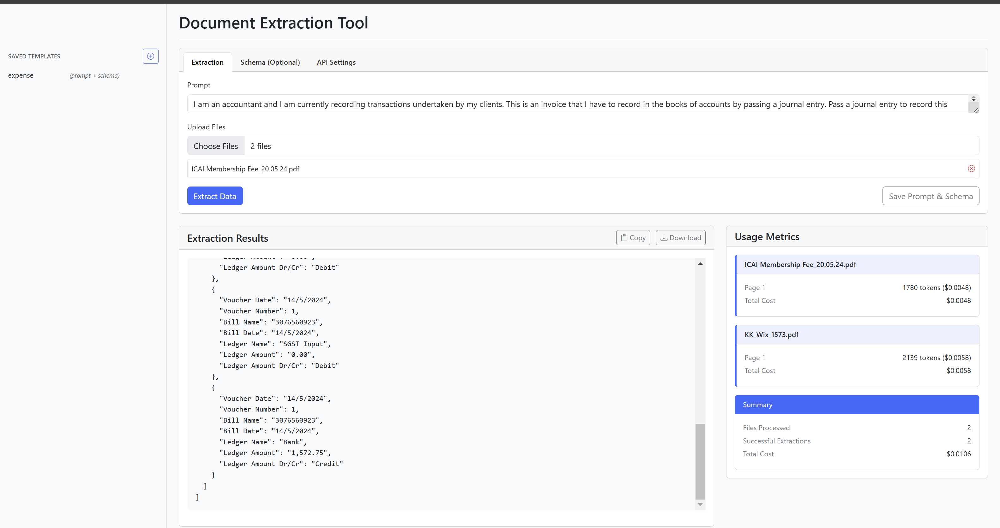
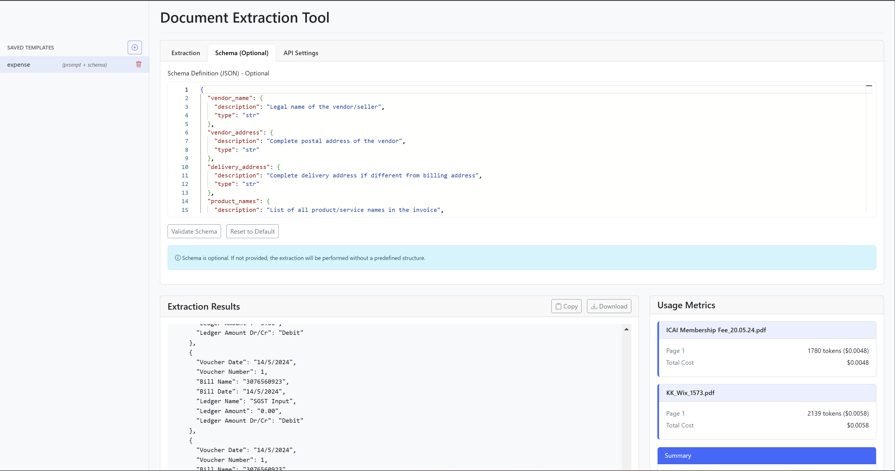
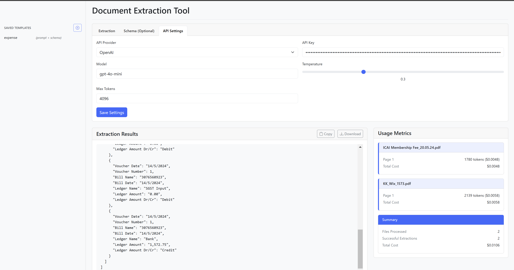

# document-extractor

A simple interface based document extractor with pydantic &amp; prompt support.



## How to use?

1. Install dependencies with Poetry:
   ```
   poetry install
   ```

2. Start the backend server:
   ```
   poetry run python -m backend.main
   ```

3. Open the frontend interface:
   ```
   open frontend/index.html
   ```

## Features
  

- **Document Processing**: Extract structured data from PDFs and images
- **Custom Prompts**: Define your own extraction prompts to target specific information
- **Schema Definition**: Optionally define Pydantic schemas for structured output
  
- **Multiple API Providers**: Support for OpenAI and Azure OpenAI
- **Template Management**: Save and reuse extraction templates through local cookies.
- **User-friendly Interface**: Simple web interface for uploading documents and configuring extractions
- **Multi-page Support**: Process multi-page PDFs with automatic page combining
- **Flexible Configuration**: Adjust model parameters like temperature and token limits
  
- **Usage Metrics**: Views usage metrics through simple cards
- **Download JSON**: Download all extracted json objects.
